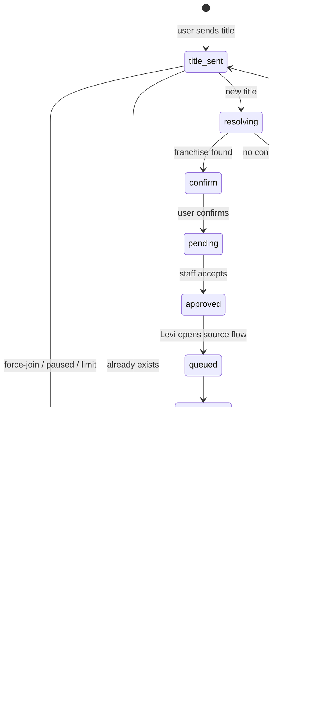
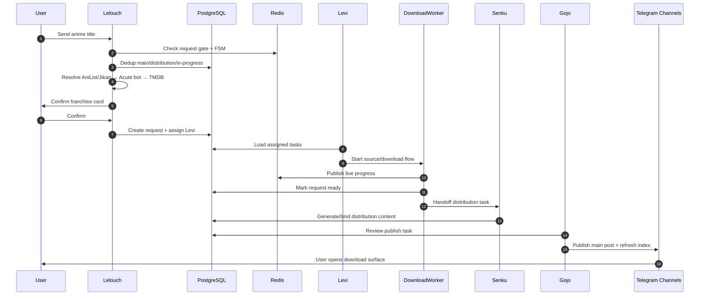
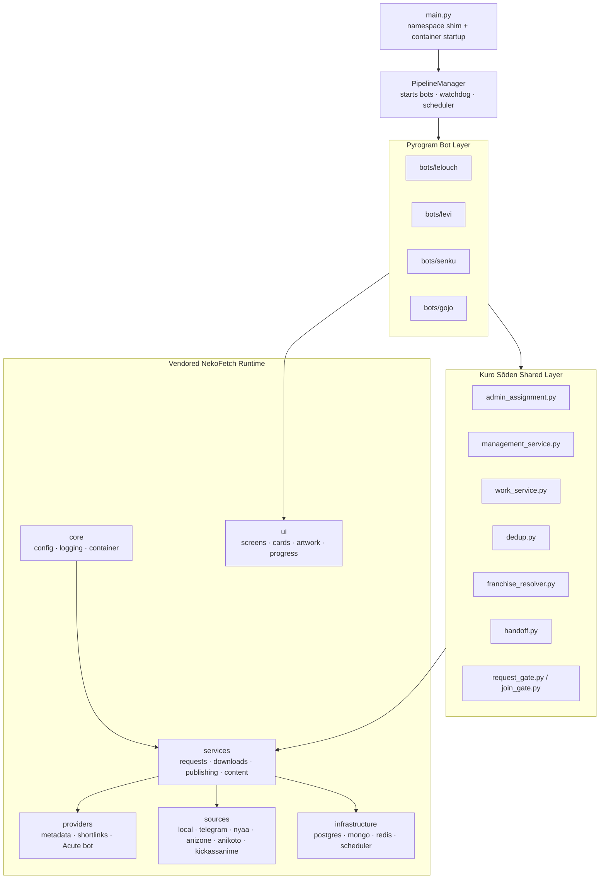
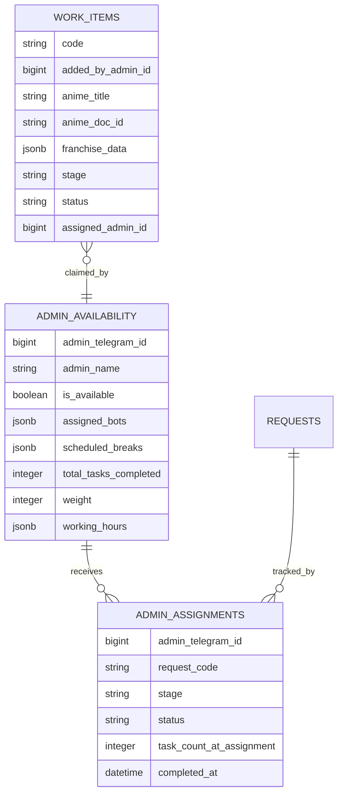

<a id="readme-top"></a>

<div align="center">


# Kuro Sōden

**黒送伝 · The Dark Relay · a four-bot Telegram anime distribution pipeline**

<p>
  <b>Lelouch accepts requests</b> → <b>Levi pulls media</b> → <b>Senku builds distribution</b> → <b>Gojo publishes</b>
</p>

<p>
  <a href="#quick-start"><b>Quick Start</b></a> ·
  <a href="#pipeline"><b>Pipeline</b></a> ·
  <a href="#the-four-bots"><b>Four Bots</b></a> ·
  <a href="#architecture"><b>Architecture</b></a> ·
  <a href="#deployment"><b>Deployment</b></a> ·
  <a href="#operations"><b>Operations</b></a>
</p>


</div>

---

## What This Is

Kuro Sōden is a **standalone repository** that packages a specialized, anime-themed orchestration layer around the NekoFetch runtime. It does not replace the NekoFetch service layer. It vendors and reuses the existing `nekofetch/` package, then splits the human workflow across four focused Telegram bots.

The result is a relay: users submit requests, staff members pick up stage-specific work, shared database state carries the job forward, and the final post lands in the main/index channels with distribution ready behind it.

> [!IMPORTANT]
> This repo is intentionally self-contained. Run it from this directory, configure the `.env` in this directory, and edit this README here. It is not the parent NekoFetch README.

<details open>
<summary><b>Contents</b></summary>

- [What This Is](#what-this-is)
- [Why It Exists](#why-it-exists)
- [Quick Start](#quick-start)
- [Pipeline](#pipeline)
- [The Four Bots](#the-four-bots)
- [Visual Identity](#visual-identity)
- [Core Capabilities](#core-capabilities)
- [Architecture](#architecture)
- [Configuration](#configuration)
- [Deployment](#deployment)
- [First Run Checklist](#first-run-checklist)
- [Commands](#commands)
- [Testing](#testing)
- [Operations](#operations)
- [Troubleshooting](#troubleshooting)
- [Roadmap](#roadmap)

</details>

## Why It Exists

One all-purpose admin bot becomes noisy once requests, downloads, source review, channel creation, thumbnail generation, publishing, recovery, staff routing, and user delivery all happen in the same room.

Kuro Sōden gives every stage its own bot and its own staff lane:

| Problem | Kuro Sōden answer |
|---|---|
| Request intake and staff work collide | Lelouch owns users, dedup, request gating, and batch work |
| Downloads need careful source review | Levi opens assigned jobs into the shared review/source flow |
| Distribution setup is repetitive | Senku wraps channel creation and generated content flows |
| Publishing needs final approval and repair tools | Gojo handles caption review, publish, scheduling surface, and recovery |
| Admin load needs fairness | Assignment rows, availability, weights, breaks, hours, and idle nudges |
| Users ask for existing titles | Dedup checks main channel, distribution entities, and in-progress requests |
| Restarts and Telegram disconnects happen | PipelineManager starts bots in order and runs a connection watchdog |

## Quick Start

```bash
git clone <repo-url> kuro-soden
cd kuro-soden

cp .env.example .env
python -m pip install -e ".[dev]"
python main.py
```

Minimum services required:

| Service | Used for |
|---|---|
| PostgreSQL | users, requests, assignments, work items, storage packs, posts |
| MongoDB | runtime settings, metadata cache, flexible content state |
| Redis | FSM state, gates, progress, cooldowns, locks |
| Telegram API credentials | Pyrogram clients for all bots |
| Four BotFather tokens | Lelouch, Levi, Senku, Gojo |
| ffmpeg + mkvtoolnix | media probing, processing, metadata, muxing |

On startup, the process prints a build stamp like:

```text
Kuro Sōden 0.1.0 · build <git-sha> <date> · 4-bot pipeline
```

Use that stamp when restarting. If it does not change after a deploy, the old process is still running.

## The Relay At A Glance

```text
User request
  ↓
Lelouch: resolve, dedup, confirm, assign
  ↓
Levi: choose source, queue download, process files
  ↓
Senku: create/generate distribution content
  ↓
Gojo: review, publish, update index, recover if needed
  ↓
Main channel + index channel + distribution entity + storage pack delivery
```

## Pipeline

The relay is database-driven. Bots do not depend on direct messages from each other to keep state alive; they read assignments, requests, work items, and service state from the shared stores.


### Request Lifecycle



### End-To-End Sequence



## The Four Bots

<table>
<tr>
<td width="25%" valign="top">

### 🎭 Lelouch

**Request Bot**

- `/start`, `/help`, `/myrequests`
- request gate and force-join check
- one-active-request limit for users
- AniList/Jikan, Acute bot, TMDB resolution chain
- duplicate detection
- batch work intake for staff
- admin pool management

</td>
<td width="25%" valign="top">

### ⚔️ Levi

**Downloader Bot**

- `/tasks`, `/settings`, `/help`
- assigned download task list
- routes into existing review/source flow
- website, torrent, Telegram/manual paths
- queues background downloads
- uses processing stages for verify, rename, metadata, branding, thumbnails, store

</td>
<td width="25%" valign="top">

### 🧪 Senku

**Distribution Bot**

- `/tasks`, `/create`, `/generate`
- channel creation guidance
- distribution entity handling
- BotContentService reuse
- info cards, season separators, guides, footer, stickers
- settings for branding and layout

</td>
<td width="25%" valign="top">

### 🔮 Gojo

**Publisher Bot**

- `/tasks`, `/publish`, `/recover`, `/schedule`
- publish preview and caption edit flow
- main channel publishing
- A-Z index refresh
- distribution channel recovery
- publishing settings and caption templates

</td>
</tr>
</table>

## Visual Identity

The repository ships local artwork for each stage bot under `images/<bot>/`. The UI helpers rotate this art into welcome cards, task screens, join gates, duplicate notices, and handoff cards so the pipeline feels like one continuous relay instead of four unrelated command shells.

<table>
<tr>
<td width="25%" align="center">
<br />
<b>Lelouch</b><br />
Request command
</td>
<td width="25%" align="center">
<br />
<b>Levi</b><br />
Download execution
</td>
<td width="25%" align="center">
<br />
<b>Senku</b><br />
Distribution buildout
</td>
<td width="25%" align="center">
<br />
<b>Gojo</b><br />
Publishing finish
</td>
</tr>
</table>

Anime-specific cards use TMDB/AniList artwork where available, then fall back to the local bot identity art. That gives request receipts, duplicate cards, handoff DMs, and task boards a consistent visual thread.

## Core Capabilities

| Area | What it does | Key files |
|---|---|---|
| Startup | Builds container, registers namespace shims, starts four bots | `main.py`, `shared/pipeline_manager.py` |
| Bot shells | Pyrogram clients, menus, command lists, stage dashboards | `bots/*/app.py`, `bots/*/handlers/` |
| Request intake | user flow, dedup, franchise cards, assignment | `bots/lelouch/handlers/requests.py` |
| Batch work | staff enters many titles; confirmed rows become work items | `bots/lelouch/handlers/batch.py`, `shared/work_service.py` |
| Admin routing | availability, weights, breaks, hours, reassignment | `shared/admin_assignment.py`, `shared/management_service.py` |
| Dedup | main channel → distribution bot → in-progress request | `shared/dedup.py` |
| Franchise resolver | AniList/Jikan → Acute bot → TMDB normalized dict | `shared/franchise_resolver.py` |
| Handoff | completed downloads notify the next stage | `shared/handoff.py` |
| Idle nudges | scheduled pings for idle on-shift admins | `shared/idle_reminder.py` |
| Processing | verify, rename, metadata, branding, watermark, thumbnail, store | `nekofetch/services/processing/` |
| Publishing | main channel post, index refresh, auto-publish path | `nekofetch/services/publishing_service.py` |
| Storage packs | Telegram database channel range delivery | `nekofetch/services/storage_channel_service.py` |
| Log channel | event stream and pinned dashboards | `nekofetch/services/log_channel_service.py` |

## Architecture



### Data Stores

| Store | Responsibility |
|---|---|
| PostgreSQL | durable relational state: users, roles, requests, queue, assignments, availability, work items, packs, posts, analytics |
| MongoDB | flexible state: runtime settings, metadata cache, message/content templates |
| Redis | fast runtime state: FSM conversations, request gate, mode, progress, cooldowns, locks |
| Local storage | downloaded files, temporary artifacts, Pyrogram sessions, rendered thumbnails |
| Telegram channels | storage packs, main posts, index posts, logs, thumbnail workflow |

### Admin Assignment Model



The assignment engine chooses admins by:

1. stage coverage (`lelouch`, `levi`, `senku`, `gojo`)
2. availability
3. active break exclusion
4. working-hours window
5. weighted active load
6. total completed count as the tie-breaker

## Configuration

Configuration has three layers:

| Layer | File/store | Purpose |
|---|---|---|
| Secrets | `.env` | Telegram tokens, DB URLs, admin ids, API keys, paths |
| Defaults | `config.yaml` | features, downloads, processing, storage, channels, UI, branding |
| Runtime overrides | MongoDB settings | live toggles changed from bot panels |

### Required `.env` Keys

```dotenv
TELEGRAM_API_ID=
TELEGRAM_API_HASH=

REQUEST_BOT_TOKEN=
DOWNLOADER_BOT_TOKEN=
DISTRIBUTION_BOT_TOKEN=
PUBLISHER_BOT_TOKEN=
ADMIN_BOT_TOKEN=

ADMIN_IDS=123456789
OWNER_ID=123456789
SECRET_KEY=change-me

POSTGRES_HOST=localhost
POSTGRES_PORT=5432
POSTGRES_USER=kuro_soden
POSTGRES_PASSWORD=change-me
POSTGRES_DB=kuro_soden

MONGO_URI=mongodb://localhost:27017
MONGO_DB=kuro_soden
REDIS_URL=redis://localhost:6379/0

STORAGE_PATH=data/storage
SESSION_PATH=data/sessions
TMDB_API_READ_ACCESS_TOKEN=
TMDB_API_KEY=
AUTO_CREATE_SCHEMA=true
```

> [!WARNING]
> Bot tokens must be the single `<id>:<token>` string from BotFather. A duplicated token string causes Telegram `ACCESS_TOKEN_INVALID`.

### High-Impact `config.yaml` Sections

| Section | Controls |
|---|---|
| `features` | request system, download queue, distribution bots, metadata editing, thumbnail generation, analytics |
| `downloads` | concurrency, retries, resume behavior, progress update interval |
| `processing` | verify, rename, metadata, branding, thumbnail, approval-before-publish |
| `security` | rate limits, force-subscribe gates |
| `storage_channel` | database channel packs and delivery copy/forward mode |
| `log_channel` | event sink and pinned dashboard/catalog messages |
| `thumbnail_channel` | asset-picking workflow and Playwright thumbnail renderer |
| `main_channel` | public post caption and Index/Download buttons |
| `index_channel` | per-letter catalog posts |
| `acquisition` | resolution × language matrix |
| `access` + `shortlink` | trial/token delivery gate |
| `sources` | enabled acquisition adapters |
| `bot` | distribution entity naming, branding, avatar/footer behavior |

## Deployment

### Local

```bash
python -m venv .venv

# Windows
.venv\Scripts\activate

# Linux / macOS
source .venv/bin/activate

python -m pip install -e ".[dev]"
python main.py
```

Local prerequisites:

- Python 3.12+
- PostgreSQL
- MongoDB
- Redis
- ffmpeg
- mkvtoolnix
- Chromium dependencies for Playwright thumbnail rendering

### Docker

```powershell
docker build -t kuro-soden .
docker run --env-file .env -v "${PWD}/data:/data" kuro-soden
```

Linux/macOS:

```bash
docker build -t kuro-soden .
docker run --env-file .env -v "$PWD/data:/data" kuro-soden
```

### Render

`render.yaml` defines a worker service:

- build: `pip install --no-cache-dir -r requirements.txt && pip install -e .`
- start: `python main.py`
- persistent disk mounted at `/data/storage`
- all secrets are `sync: false`

### Railway / Koyeb / VPS

Use the same rules everywhere:

1. create managed Postgres, MongoDB, and Redis
2. set every `.env.example` secret
3. mount persistent storage for `/data/storage` and `/data/sessions`
4. run `alembic upgrade head` when `AUTO_CREATE_SCHEMA=false`
5. run `python main.py`

## First Run Checklist

1. Create four BotFather bots and set:
   - `REQUEST_BOT_TOKEN`
   - `DOWNLOADER_BOT_TOKEN`
   - `DISTRIBUTION_BOT_TOKEN`
   - `PUBLISHER_BOT_TOKEN`
2. Add owner/admin ids to `ADMIN_IDS`.
3. Create channels:
   - storage/database channel
   - log channel
   - main channel
   - index channel
   - optional thumbnail workflow channel
4. Add the needed bot/client as admin in each channel.
5. Fill channel ids in `config.yaml`.
6. Start the process.
7. Open Lelouch and send `/start`.
8. Use the admin panel to muster admins into the pool and assign stages.
9. Submit a small test request.
10. Follow it through Levi → Senku → Gojo.

## Commands

| Bot | Commands |
|---|---|
| Lelouch | `/start`, `/myrequests`, `/help`, `/admin`, `/settings`, `/batch` |
| Levi | `/start`, `/tasks`, `/settings`, `/help` |
| Senku | `/start`, `/tasks`, `/create`, `/generate`, `/settings`, `/help` |
| Gojo | `/start`, `/tasks`, `/publish`, `/recover`, `/schedule`, `/settings`, `/help` |

Most serious work is button-driven after entry. Commands open the correct surface; callbacks drive the stage.

## Project Layout

```text
.
├── main.py                         # process entry; starts the four-bot relay
├── pyproject.toml                  # package metadata and dev dependencies
├── requirements.txt                # runtime dependencies for Docker/platforms
├── config.yaml                     # feature and behavior defaults
├── render.yaml                     # Render worker service
├── Dockerfile                      # Python 3.12 slim image with media tooling
├── bots/
│   ├── lelouch/                    # request bot and management control plane
│   ├── levi/                       # downloader bot task surface
│   ├── senku/                      # distribution bot task surface
│   └── gojo/                       # publisher bot task surface
├── shared/
│   ├── pipeline_manager.py         # bot lifecycle, watchdog, scheduler
│   ├── admin_assignment.py         # assignment ORM + engine
│   ├── management_service.py       # admin pool control plane
│   ├── work_service.py             # admin-added work items
│   ├── dedup.py                    # duplicate detection
│   ├── franchise_resolver.py       # provider chain normalization
│   ├── handoff.py                  # download-to-distribution handoff
│   ├── join_gate.py                # request membership gate
│   └── lelouch_voice.py            # Lelouch copy and button labels
├── nekofetch/
│   ├── core/                       # config, logging, constants, container
│   ├── bots/                       # vendored admin/distribution handlers
│   ├── services/                   # business workflows
│   ├── sources/                    # acquisition adapters
│   ├── providers/                  # metadata, shortlinks, filestore, Acute bot
│   ├── infrastructure/             # DB, Redis, repositories, scheduler
│   ├── ui/                         # cards, artwork, terminal, progress
│   ├── localization/               # messages and i18n
│   └── domain/                     # enums and domain values
├── migrations/                     # Alembic revisions
├── tests/                          # 335 collected tests
├── docs/                           # architecture, deployment, scraper guide
├── images/                         # per-bot artwork
├── resources/                      # language and canonical data
├── thumbnail/                      # HTML/CSS thumbnail renderer assets
└── playground/                     # diagnostics and probes
```

## Testing

```bash
pytest
pytest tests/test_lelouch_routing.py
pytest tests/test_work_items.py
pytest tests/test_management_service.py
pytest --collect-only -q
```

The suite currently collects **335 tests** covering:

| Area | Coverage |
|---|---|
| Assignment | availability, breaks, weighted routing, hours, completion counters |
| Work items | batch add, rate-limit isolation, stage drain, lifecycle |
| Dedup | priority order, fuzzy title fallback, unicode, empty input |
| Routing | Lelouch callbacks, no-dead-tap guard, app imports |
| Management | pool CRUD, availability, breaks, reassignment, idle admins |
| Idle reminders | fires, suppression, cooldown, DM failure resilience |
| Integration | config, schema creation, handoff, session rollback, request codes |
| Artwork | per-anime rotation, TMDB seeding, fallback behavior |

## Operations

### Logs

Use both process logs and the Telegram log channel.

```bash
docker logs -f <container>
# or
python main.py
```

The log channel can maintain:

- event stream
- pinned live stats dashboard
- pinned catalog index
- queue/download/publish/error notices

### Migrations

```bash
alembic upgrade head
alembic revision --autogenerate -m "describe change"
```

For first boot in a dev setup, `AUTO_CREATE_SCHEMA=true` can create tables automatically. For production, prefer Alembic and set `AUTO_CREATE_SCHEMA=false`.

### Restart Safety

- Keep `data/sessions` persistent or Pyrogram clients will need fresh authorization.
- Keep `data/storage` persistent or cached media/thumbnails disappear.
- Check the startup build stamp after every deploy.
- The connection watchdog probes Telegram clients and attempts clean restarts.

### Backups

Back up:

- PostgreSQL database
- MongoDB database
- Redis if you need live FSM/gate continuity
- `data/storage`
- `data/sessions`

## Source And Metadata Policy

Kuro Sōden is built around pluggable source adapters. Enable only sources you are allowed to use in your environment.

Current source layer includes adapters under `nekofetch/sources/`, including local, Telegram, torrent helpers, and site-specific integrations configured by the operator. Metadata enrichment is isolated under `nekofetch/providers/metadata/`; implement the provider fetchers against your approved metadata source and flip the provider flag when ready.

## Troubleshooting

| Symptom | Likely cause | Fix |
|---|---|---|
| Bot does not start | missing or malformed bot token | check `.env`; token must be one BotFather string |
| Only some bots start | one stage token missing | set all four pipeline token variables |
| No admin buttons | your id is not in `ADMIN_IDS` or role middleware did not seed you | update `.env`, restart, open `/start` |
| Requests do not open | request gate paused or force-join unmet | open Lelouch admin panel; check `security.force_subscribe_channels` |
| Duplicate card appears | title already exists in main/distribution/in-progress state | follow the card link or wait for publish |
| Levi shows no tasks | no active assignment for your Telegram id | assign yourself to `levi` in Lelouch management |
| Senku/Gojo task list is empty | previous stage has not handed off yet | check request status and log channel |
| Publishing fails | channel id, admin rights, missing media, or caption issue | verify bot/channel rights and process logs |
| Storage delivery fails | bot lacks storage channel rights or pack range is invalid | re-check channel admin rights and indexed message ids |
| Old code appears after deploy | stale process still running | compare startup build stamp, stop old worker |

## Roadmap

- stronger task cards for Senku and Gojo that open direct per-request flows from `/tasks`
- richer `/schedule` execution behind Gojo's current scheduling surface
- expanded update detector for already-owned titles
- custom franchise segmentation for long-running series
- broader analytics windows for staff throughput and title demand
- more provider adapters behind the same normalized franchise contract

## Credits In The Code

Kuro Sōden is shaped around four stage identities:

- **Lelouch Vi Britannia**: request command, strategy, staff control
- **Levi Ackerman**: source picking, download discipline, task execution
- **Senku Ishigami**: distribution construction and content generation
- **Gojo Satoru**: publishing, index control, recovery

The characters are UI flavor. The engineering contract is the relay: one clear stage, one shared state model, one next handoff.

---

<div align="center">

**Kuro Sōden** · four bots · one event loop · shared state · no silent handoff

<a href="#readme-top">Back to top</a>

</div>
