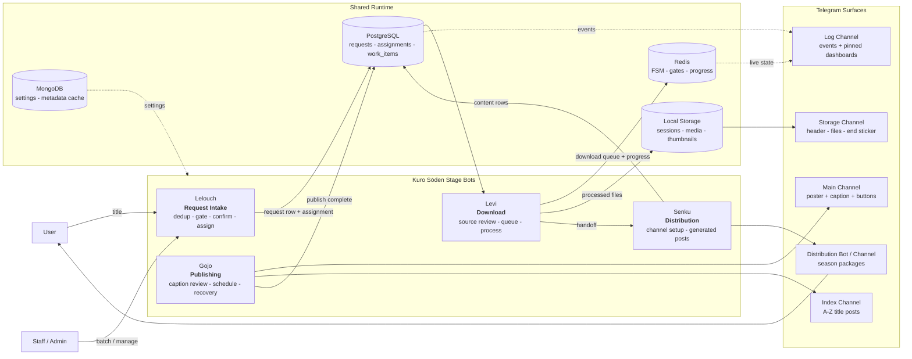
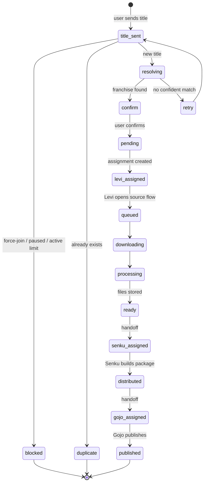
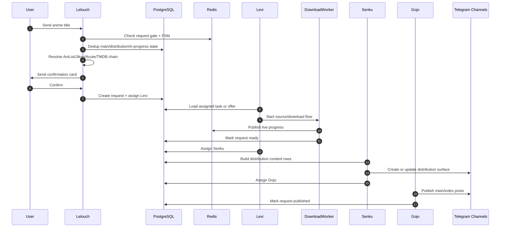
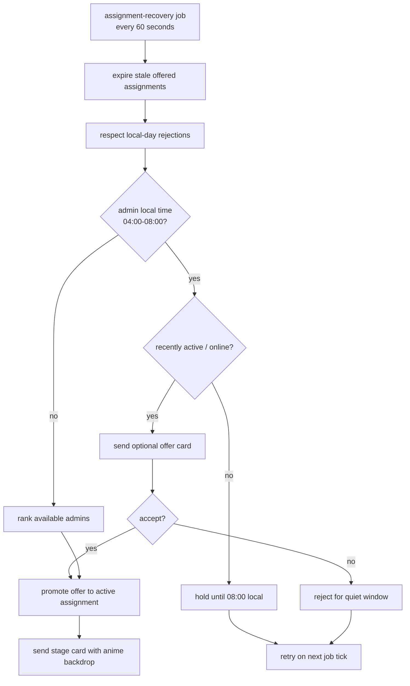
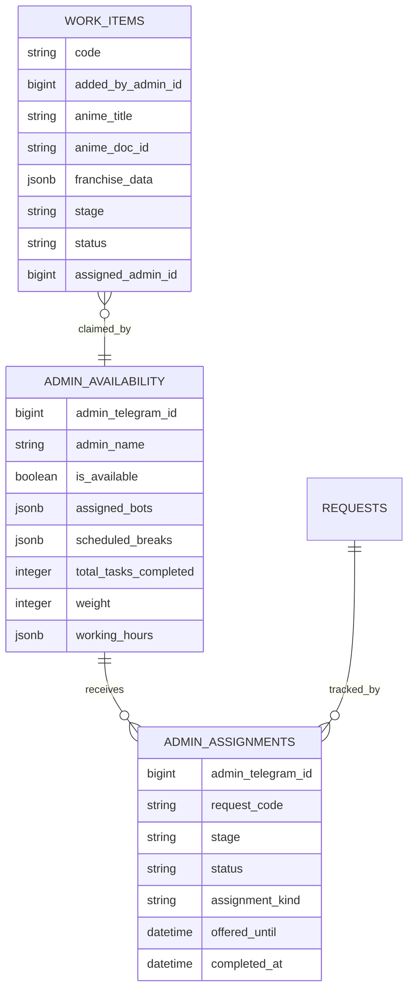
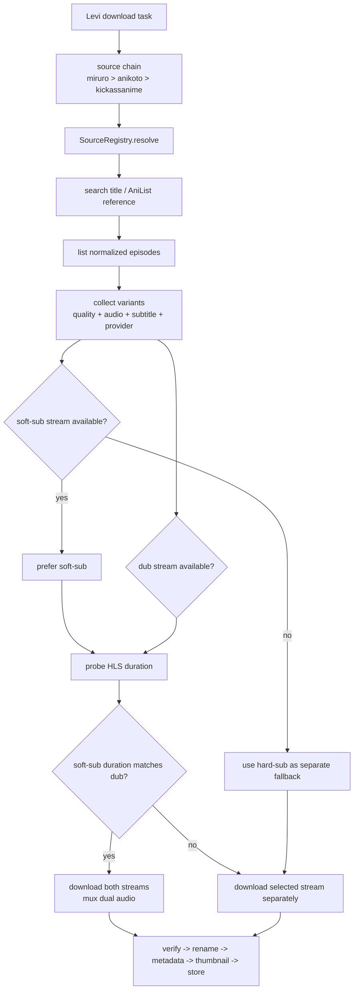
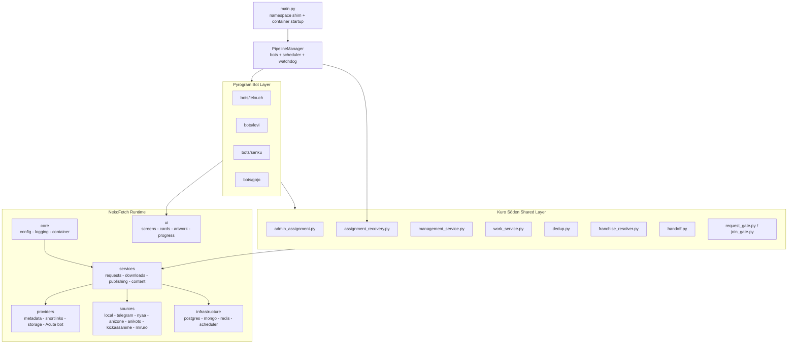

<a id="top"></a>

<!-- Kuro Sōden · 黒送伝 · README -->

<div align="center">


# Kuro Sōden (黒送伝)

### The Dark Relay - four anime-themed Telegram bots for request intake, downloads, distribution, and publishing


<br /><br />

[](https://www.python.org/)
[](https://github.com/Mayuri-Chan/pyrofork)
[](https://www.sqlalchemy.org/)
[](https://www.postgresql.org/)
[](https://www.mongodb.com/)
[](https://redis.io/)
[](#testing)
[](#deployment)
[](https://github.com/astral-sh/ruff)

<br /><br />

<p>
  <a href="#what-this-is"><b>What</b></a> ·
  <a href="#pipeline-diagrams"><b>Pipeline</b></a> ·
  <a href="#admin-assignment-engine"><b>Admin Engine</b></a> ·
  <a href="#download-sources"><b>Sources</b></a> ·
  <a href="#deployment"><b>Deploy</b></a> ·
  <a href="#commands-reference"><b>Commands</b></a> ·
  <a href="#testing"><b>Tests</b></a>
</p>

<br />

```
╔═══════════════════════════════════════════════════════════════════════════════╗
║                                                                               ║
║   Lelouch              Levi              Senku              Gojo              ║
║   Request Intake  ->   Download     ->   Distribution   ->  Publishing        ║
║   Dedup Check          Source Review      Channel Build      Index Update     ║
║   Admin Assign         Process Files      Package Flow       Recovery         ║
║                                                                               ║
╚═══════════════════════════════════════════════════════════════════════════════╝
```

</div>

---

## Contents

- [What This Is](#what-this-is)
- [30-Second Quick Start](#30-second-quick-start)
- [Current Build Highlights](#current-build-highlights)
- [The Relay At A Glance](#the-relay-at-a-glance)
- [Pipeline Diagrams](#pipeline-diagrams)
- [The Four Bots](#the-four-bots)
- [Admin Assignment Engine](#admin-assignment-engine)
- [Visual Identity](#visual-identity)
- [Download Sources](#download-sources)
- [Architecture](#architecture)
- [Configuration](#configuration)
- [Deployment](#deployment)
- [First Run Checklist](#first-run-checklist)
- [Commands Reference](#commands-reference)
- [Project Layout](#project-layout)
- [Testing](#testing)
- [Operations](#operations)
- [Troubleshooting](#troubleshooting)
- [Roadmap](#roadmap)
- [Glossary](#glossary)

---

## What This Is

Kuro Sōden is a production Telegram relay for anime content operations. It splits a single user request into four controlled stages:

| Stage | Bot | Job |
|---|---|---|
| Request | Lelouch | user intake, title resolution, duplicate checks, request gating, admin control plane |
| Download | Levi | source review, queueing, download supervision, file processing |
| Distribution | Senku | channel/bot creation, package generation, thumbnail flow, distribution setup |
| Publish | Gojo | final review, caption editing, scheduled publishing, recovery, index updates |

The runtime is database-driven. The bots do not depend on direct Telegram messages to pass state. Requests, assignments, work items, content rows, and progress live in shared stores so a process restart can pick the pipeline back up.

Kuro Sōden is built around NekoFetch internals, but the root project is now the orchestration shell: the `bots/` package owns Telegram surfaces, `shared/` owns relay-specific logic, and `nekofetch/` carries the core services, providers, sources, UI, and infrastructure.

## 30-Second Quick Start

```bash
git clone <your-repo-url>
cd KuroSoden

python -m venv .venv
source .venv/bin/activate

python -m pip install -e ".[dev]"
cp .env.example .env
# edit .env and config.yaml

alembic upgrade head
python main.py
```

Windows:

```powershell
git clone <your-repo-url>
cd KuroSoden

py -3.12 -m venv .venv
.\.venv\Scripts\Activate.ps1

python -m pip install -e ".[dev]"
Copy-Item .env.example .env
# edit .env and config.yaml

alembic upgrade head
python main.py
```

Launchers are included:

```powershell
.\run.bat
```

```bash
bash run.sh
```

Both launchers create `.venv`, install the editable package, warn when `.env` is missing, and start `main.py`.

## Current Build Highlights

| Area | Current behavior |
|---|---|
| Four-bot runtime | `PipelineManager` starts Lelouch, Levi, Senku, and Gojo from four BotFather tokens on one event loop. |
| Recovery scheduler | The scheduler starts download workers, idle reminders, assignment recovery, Gojo maintenance, and the Telegram connection watchdog. |
| Staff scoping | Levi, Senku, and Gojo are staff-only. Lelouch remains user-facing, with admin surfaces gated by role. |
| Request gate | Lelouch enforces force-join, global request pause, one-active-request limits, duplicate detection, and confirmation cards. |
| Assignment offers | Recently active admins outside their current slot receive one-hour offers with Accept and Reject buttons. |
| Quiet hours | Local 04:00-08:00 assignments are held unless the admin is active and chooses to accept the offer. |
| Stage handoff | Levi completion assigns Senku; Senku completion assigns Gojo. `notify_stage_assignment` sends stage-specific task cards. |
| Anime artwork | Stage cards and request cards use anime backdrop art when available, with configured art fallbacks. |
| Schema safety | Alembic owns production migrations; development startup can reconcile schema when `AUTO_CREATE_SCHEMA=true`. |
| Test state | Latest full verification in this workspace: 650 passed, 5 skipped. |

## The Relay At A Glance

```text
User request
  |
  v
Lelouch: resolve title, dedup, gate, confirm, assign Levi
  |
  v
Levi: review source, queue download, process files, hand off
  |
  v
Senku: create distribution surface, generate package, hand off
  |
  v
Gojo: review caption, schedule or publish, update index, recover
  |
  v
Storage channel + main channel + index channel + distribution entity
```

## Pipeline Diagrams

### Relay Flow



### Request Lifecycle



### End-To-End Sequence



### Assignment Recovery



## The Four Bots

### Lelouch - Request Bot and Control Plane

| Surface | Behavior |
|---|---|
| `/start` | user entry, force-join checks, status surface |
| `/myrequests` | personal request history |
| `/help` | user-facing help |
| `/admin` | staff control plane for requests, batches, pools, and management |
| `/settings` | owner/admin settings surface, hidden from unauthorized staff menus |
| `/batch` | admin batch work item creation and routing |

Lelouch owns title intake. It resolves franchise data, checks duplicates, prevents users from stacking active requests, and assigns the first real work stage to Levi.

### Levi - Download Bot

| Surface | Behavior |
|---|---|
| `/tasks` | assigned downloads and optional offers |
| Source flow | provider selection, episode normalization, quality/audio review |
| Worker handoff | queues downloads and progress into the shared runtime |
| Completion | marks files ready and assigns Senku |

Levi is staff-only. Non-staff users are intercepted by middleware before task handlers run.

### Senku - Distribution Bot

| Surface | Behavior |
|---|---|
| `/tasks` | assigned distribution tasks and offers |
| `/create` | distribution channel or bot wizard |
| `/generate` | package generation surface |
| Wizard | userbot-created channels, invite promotion, watch-order confirmation |
| Thumbnail loop | thumbnail-channel workflow and rendered assets |

Senku turns processed media into a distribution surface the end user can actually consume.

### Gojo - Publisher Bot

| Surface | Behavior |
|---|---|
| `/tasks` | assigned publishing tasks and offers |
| `/publish` | final review surface |
| `/schedule` | delayed publish path |
| `/recover` | recovery tools for interrupted publishing |
| `/updates` | update and maintenance checks |
| `/bancheck` | distribution health and ban checks |
| `/settings` | owner-level publishing configuration |

Gojo owns the final public surfaces: main channel posts, index posts, captions, buttons, silent publish, scheduling, and recovery.

## Admin Assignment Engine

The assignment engine lives in `shared/admin_assignment.py`. Recovery lives in `shared/assignment_recovery.py`. Stage cards are sent through `shared/handoff.py`.

Routing considers:

| Signal | Effect |
|---|---|
| Stage coverage | admins must be configured for the stage: `lelouch`, `levi`, `senku`, or `gojo` |
| Availability | unavailable admins are skipped |
| Local working hours | active slots receive normal assignments |
| Quiet hours | local 04:00-08:00 assignments are deferred unless the admin is active and accepts an offer |
| Scheduled breaks | admins on break are skipped |
| Existing task count | lower active load ranks higher |
| Weight | configured seniority/capacity affects tie-breaking |
| Rejections | offer rejection blocks that quiet-window offer for the local day |
| Stale offers | unaccepted offers expire after one hour and return to routing |



The database enforces one open assignment per request and stage through a partial unique index. Startup can self-heal that index in development mode, but production deploys belong to Alembic.

## Visual Identity

Kuro Sōden uses stage-specific voice and anime artwork on task cards.

| Asset path | Role |
|---|---|
| `images/lelouch/` | request and command identity |
| `images/levi/` | download task identity |
| `images/senku/` | distribution task identity |
| `images/gojo/` | publishing task identity |
| `images/art_*.jpg` | fallback art pool |
| `thumbnail/` | rendered thumbnail assets and HTML template |

Anime request cards use backdrop art from franchise metadata whenever the request has it. If metadata lacks a backdrop, the card falls back to configured art while preserving the same Telegram image width and card structure.

## Download Sources

Source adapters live under `nekofetch/sources/`. The source chain is configured in `config.yaml`.

| Source | Role |
|---|---|
| `local` | staff-provided local files |
| `telegram` | Telegram/manual acquisition path |
| `anikoto` | AniKoto source integration |
| `kickassanime` | website fallback adapter |
| `anizone` | website fallback adapter |
| `miruro` | self-hosted Miruro-API source |
| `nyaa` | torrent/manual review path |

### Source Decision Flow



Hard-sub streams are not merged into dual audio. Dual audio is only valid when the subtitle-side video carries soft subtitles and the dub stream duration matches closely enough.

### Miruro Configuration

`miruro` expects a running self-hosted Miruro-API service.

```yaml
sources:
  enabled: [local, telegram, anikoto, kickassanime, anizone, miruro, nyaa]
  default: telegram
  miruro:
    api_base_url: http://localhost:8000
    stream_referer: http://localhost:8000
    preferred_quality: 1080p
    provider_order: [kiwi, arc, zoro, hop, pahe]
```

## Architecture



### Data Stores

| Store | Responsibility |
|---|---|
| PostgreSQL | durable relational state: users, roles, requests, queue, assignments, availability, work items, packs, posts, analytics |
| MongoDB | flexible state: runtime settings, metadata cache, message/content templates |
| Redis | fast runtime state: FSM conversations, request gate, mode, progress, cooldowns, locks |
| Local storage | downloaded files, temporary artifacts, Pyrogram sessions, rendered thumbnails |
| Telegram channels | storage packs, main posts, index posts, logs, thumbnail workflow |

### Runtime Services

| Service | Location | Job |
|---|---|---|
| Pipeline lifecycle | `shared/pipeline_manager.py` | starts bots, workers, scheduler jobs, and watchdog |
| Assignment | `shared/admin_assignment.py` | ranks admins and creates stage assignments/offers |
| Recovery | `shared/assignment_recovery.py` | expires offers, wakes deferred work, restores missing stage assignments |
| Handoff | `shared/handoff.py` | assigns next stage and sends image-backed task cards |
| Work items | `shared/work_service.py` | batch/admin-added work queue |
| Downloads | `nekofetch/services/download_service.py` | download orchestration and file processing |
| Publishing | `nekofetch/services/publish_service.py` | main/index/distribution publishing |

## Configuration

Secrets belong in `.env`. Behavior belongs in `config.yaml`.

### Required `.env` Keys

| Key | Required | Purpose |
|---|---:|---|
| `TELEGRAM_API_ID` | yes | Telegram API application id |
| `TELEGRAM_API_HASH` | yes | Telegram API application hash |
| `REQUEST_BOT_TOKEN` | yes | Lelouch BotFather token |
| `DOWNLOADER_BOT_TOKEN` | yes | Levi BotFather token |
| `DISTRIBUTION_BOT_TOKEN` | yes | Senku BotFather token |
| `PUBLISHER_BOT_TOKEN` | yes | Gojo BotFather token |
| `ADMIN_BOT_TOKEN` | yes | legacy/admin compatibility token used by shared config |
| `ADMIN_IDS` | yes | comma-separated Telegram ids with staff access |
| `OWNER_ID` | yes | owner Telegram id for owner-only settings |
| `POSTGRES_HOST` / `POSTGRES_PORT` | yes | PostgreSQL endpoint |
| `POSTGRES_USER` / `POSTGRES_PASSWORD` / `POSTGRES_DB` | yes | PostgreSQL credentials and database |
| `MONGO_URI` / `MONGO_DB` | yes | MongoDB connection |
| `REDIS_URL` | yes | Redis connection |
| `STORAGE_PATH` | yes | persistent media/artifact path |
| `SESSION_PATH` | yes | persistent Pyrogram session path |
| `SECRET_KEY` | yes | encryption/signing secret |
| `AUTO_CREATE_SCHEMA` | environment-dependent | `true` for dev bootstrap, `false` for production migrations |
| `TMDB_API_READ_ACCESS_TOKEN` | recommended | TMDB metadata and backdrop images |
| `TMDB_API_KEY` | optional | alternate TMDB credential |
| `IMGBB_API_KEY` | optional | thumbnail/image backup URL support |
| `TELEGRAM_USERBOT_SESSION` | optional | single userbot session |
| `TELEGRAM_USERBOT_ACCOUNTS` | optional | JSON list of userbot accounts |
| `TELEGRAM_USERBOT_ACCOUNTS_FILE` | optional | external JSON account file |
| `MIRURO_API_BASE_URL` | optional | Miruro-API endpoint |
| `MIRURO_STREAM_REFERER` | optional | stream referer for Miruro providers |
| `LOG_LEVEL` / `LOG_JSON` | optional | process log behavior |

Generate a strong secret:

```bash
python -c "import secrets; print(secrets.token_urlsafe(48))"
```

### High-Impact `config.yaml` Sections

| Section | Controls |
|---|---|
| `features` | request system, queue, distribution bots, metadata editing, thumbnails, temporary links, analytics, audit logs |
| `downloads` | concurrency, retry behavior, per-task timeout |
| `processing` | aria2 torrent fetches, ffmpeg/mkvtoolnix flow, subtitles, audio handling |
| `rename` | filename templates and language labels |
| `metadata` | AniList/Jikan/TMDB provider behavior |
| `thumbnail` | renderer, templates, upload and backup behavior |
| `branding` | bot display copy, footer image/text |
| `distribution` | protect content, temporary links, distribution surfaces |
| `security` | owner id, force-subscribe channels, access policy |
| `storage_channel` | storage pack formatting and delivery messages |
| `log_channel` | operational events and dashboards |
| `main_channel` / `index_channel` | publish destinations |
| `thumbnail_channel` | thumbnail workflow channel |
| `access` / `shortlink` | access token and shortlink provider behavior |
| `acquisition` | language, resolution, fallback, provider order |
| `sources` | enabled adapters and per-source settings |
| `post_format` | captions, buttons, pinning, premium emoji |

## Deployment

### 0. Pre-Flight

Before choosing a platform:

1. Create four BotFather bots: request, downloader, distribution, publisher.
2. Create or choose storage, log, main, index, and optional thumbnail channels.
3. Add the correct bot or userbot as admin wherever it posts, edits, pins, or reads.
4. Prepare PostgreSQL, MongoDB, and Redis.
5. Decide where persistent storage lives for media and Pyrogram sessions.
6. Fill `.env` from `.env.example`.
7. Fill channel ids and behavior in `config.yaml`.
8. Run `alembic upgrade head` for production-style database setup.

### 1. Local Bare Metal

Linux/macOS:

```bash
sudo apt-get update
sudo apt-get install -y aria2 ffmpeg mkvtoolnix

python -m venv .venv
source .venv/bin/activate
python -m pip install -U pip
python -m pip install -e ".[dev]"
python -m playwright install chromium

cp .env.example .env
alembic upgrade head
python main.py
```

Windows:

```powershell
winget install Gyan.FFmpeg
winget install Python.Python.3.12

py -3.12 -m venv .venv
.\.venv\Scripts\Activate.ps1
python -m pip install -U pip
python -m pip install -e ".[dev]"
python -m playwright install chromium

Copy-Item .env.example .env
alembic upgrade head
python main.py
```

### 2. Docker

The repository ships a `Dockerfile`. It uses Python 3.12 slim, installs `aria2`, `ffmpeg`, `mkvtoolnix`, Playwright Chromium, runtime requirements, and starts `python main.py`.

PowerShell:

```powershell
docker build -t kuro-soden .
docker run --env-file .env -v "${PWD}/data:/data" kuro-soden
```

Linux/macOS:

```bash
docker build -t kuro-soden .
docker run --env-file .env -v "$PWD/data:/data" kuro-soden
```

There is no checked-in Compose manifest. If you use Compose, wire this image to external Postgres, MongoDB, and Redis services and mount persistent volumes for `/data/storage` and `/data/sessions`.

### 3. Render

`render.yaml` defines the worker:

| Field | Value |
|---|---|
| service | `kuro-soden` worker |
| build | `pip install --no-cache-dir -r requirements.txt && pip install -e .` |
| start | `python main.py` |
| disk | 10 GB mounted at `/data/storage` |
| secrets | `sync: false`, set in Render dashboard |

Recommended Render path:

1. Connect the repository.
2. Let Render read `render.yaml`.
3. Add Postgres, Redis, and MongoDB connection values.
4. Add every required `.env.example` secret.
5. Mount persistent storage for sessions and media.
6. Run migrations once through a shell or deploy hook.
7. Start the worker.

### 4. Railway

Railway works best with the Dockerfile or Nixpacks plus managed services.

```bash
railway login
railway init
railway link
```

1. Add PostgreSQL and Redis services.
2. Use MongoDB Atlas or a Railway MongoDB template.
3. Set the four bot tokens, owner/admin ids, Telegram API credentials, and storage/session paths.
4. Add a persistent volume mounted to `/data`.
5. Set `AUTO_CREATE_SCHEMA=false` after migrations are stable.
6. Deploy from the connected Git branch.

### 5. Koyeb

Koyeb can run the Dockerfile as a worker with external data services.

```bash
koyeb login
koyeb app create kuro-soden
```

Use:

- Docker build from this repository
- external Postgres, MongoDB, and Redis
- persistent volume for `/data`
- start command: `python main.py`
- production migrations: `alembic upgrade head`

### 6. Linux VPS / VM

```bash
sudo apt-get update
sudo apt-get install -y python3.12 python3.12-venv aria2 ffmpeg mkvtoolnix postgresql redis-server

git clone <your-repo-url> KuroSoden
cd KuroSoden
python3.12 -m venv .venv
source .venv/bin/activate
python -m pip install -U pip
python -m pip install -e ".[dev]"

cp .env.example .env
alembic upgrade head
python main.py
```

Systemd unit:

```ini
[Unit]
Description=Kuro Sōden Telegram Relay
After=network-online.target
Wants=network-online.target

[Service]
Type=simple
WorkingDirectory=/opt/kuro-soden
EnvironmentFile=/opt/kuro-soden/.env
ExecStart=/opt/kuro-soden/.venv/bin/python main.py
Restart=always
RestartSec=10
User=kuro
Group=kuro

[Install]
WantedBy=multi-user.target
```

### 7. Android Termux / Cluterms

Termux works for small test runs, not heavy production media work.

```bash
pkg update
pkg install python git aria2 ffmpeg postgresql redis
git clone <your-repo-url> KuroSoden
cd KuroSoden
python -m venv .venv
source .venv/bin/activate
python -m pip install -e ".[dev]"
cp .env.example .env
python main.py
```

Use external MongoDB unless you are running a full Linux container/chroot. Keep sessions and storage on persistent app-accessible storage.

## First Run Checklist

1. Create four BotFather bots and set `REQUEST_BOT_TOKEN`, `DOWNLOADER_BOT_TOKEN`, `DISTRIBUTION_BOT_TOKEN`, and `PUBLISHER_BOT_TOKEN`.
2. Add owner/admin ids to `ADMIN_IDS` and `OWNER_ID`.
3. Create storage, log, main, index, and optional thumbnail channels.
4. Add bots/userbot accounts as admins in the channels they need.
5. Fill channel ids and behavior in `config.yaml`.
6. Configure Postgres, MongoDB, and Redis.
7. Run `alembic upgrade head` or use `AUTO_CREATE_SCHEMA=true` only for development bootstrap.
8. Start `python main.py`.
9. Open Lelouch and send `/start`.
10. Use Lelouch management to add admins, set stages, working hours, slots, and availability.
11. Submit a small test request and follow it through Levi, Senku, and Gojo.

## Commands Reference

### Bot Commands

| Bot | Commands | Access |
|---|---|---|
| Lelouch | `/start`, `/myrequests`, `/help` | users |
| Lelouch | `/admin`, `/settings`, `/batch` | staff/admin/owner surfaces |
| Levi | `/start`, `/tasks`, `/help` | staff only |
| Senku | `/start`, `/tasks`, `/create`, `/generate`, `/help` | staff only |
| Gojo | `/start`, `/tasks`, `/publish`, `/recover`, `/schedule`, `/updates`, `/bancheck`, `/settings`, `/help` | staff only, with owner-only settings where configured |

### Development And Operations

| Command | Purpose |
|---|---|
| `python main.py` | start the relay |
| `python -m nekofetch` | alternate package entry |
| `python -m pip install -e ".[dev]"` | install package and dev tools |
| `pytest` | run the full test suite |
| `pytest tests/test_admin_assignment.py` | run focused assignment tests |
| `pytest --collect-only -q` | inspect collected tests |
| `ruff check .` | lint imports, async rules, pyupgrade, bugbear |
| `mypy src` | strict type checking for legacy/package source layouts |
| `alembic upgrade head` | apply migrations |
| `alembic revision --autogenerate -m "message"` | create migration |
| `python scripts/clear_database.py` | interactive reset helper |
| `python scripts/clear_database.py --all --yes` | destructive Postgres + Mongo + Redis reset |
| `python scripts/userbot_manager.py` | manage userbot sessions/accounts |
| `.\add_userbot.bat` | Windows userbot manager launcher |
| `bash add_userbot.sh` | Unix userbot manager launcher |
| `docker build -t kuro-soden .` | build image |
| `docker logs -f <container>` | follow container logs |

## Project Layout

```text
.
|-- main.py                         # process entry; starts the relay
|-- pyproject.toml                  # package metadata and dev dependencies
|-- requirements.txt                # runtime dependencies for Docker/platforms
|-- config.yaml                     # behavior defaults
|-- render.yaml                     # Render worker service
|-- Dockerfile                      # Python 3.12 image with media tooling
|-- bots/
|   |-- lelouch/                    # request bot and management control plane
|   |-- levi/                       # downloader bot task surface
|   |-- senku/                      # distribution bot task surface
|   `-- gojo/                       # publisher bot task surface
|-- shared/
|   |-- pipeline_manager.py         # bot lifecycle, watchdog, scheduler
|   |-- admin_assignment.py         # assignment ORM + engine
|   |-- assignment_recovery.py      # offer expiry and deferred-task recovery
|   |-- handoff.py                  # stage cards and assignment handoff
|   |-- management_service.py       # admin pool control plane
|   |-- work_service.py             # admin-added work items
|   |-- dedup.py                    # duplicate detection
|   `-- franchise_resolver.py       # provider chain normalization
|-- nekofetch/
|   |-- core/                       # config, logging, constants, container
|   |-- bots/                       # shared bot middleware and handlers
|   |-- services/                   # request/download/publish workflows
|   |-- sources/                    # acquisition adapters
|   |-- providers/                  # metadata, shortlinks, filestore, Acute bot
|   |-- infrastructure/             # Postgres, Mongo, Redis, scheduler
|   |-- ui/                         # cards, artwork, terminal, progress
|   |-- localization/               # messages and i18n
|   `-- domain/                     # enums and domain values
|-- migrations/                     # Alembic revisions
|-- tests/                          # pytest suite
|-- scripts/                        # reset and userbot utilities
|-- docs/                           # architecture, deployment, scraper guide
|-- images/                         # stage art and fallback artwork
|-- resources/                      # language and canonical data
|-- thumbnail/                      # HTML/CSS thumbnail renderer assets
`-- playground/                     # diagnostics and probes
```

## Testing

```bash
pytest
pytest tests/test_admin_assignment.py
pytest tests/test_pipeline_manager.py
pytest tests/test_gojo_maintenance_jobs.py
pytest --collect-only -q
```

Latest workspace verification:

```text
650 passed, 5 skipped, 11 warnings
```

Coverage areas:

| Area | Coverage |
|---|---|
| Assignment | availability, breaks, weighted routing, local hours, quiet offers, rejection windows, completion counters |
| Recovery | stale offer expiry, deferred work after 08:00 local, missing stage assignment restoration |
| Work items | batch add, rate-limit isolation, stage drain, lifecycle |
| Dedup | priority order, fuzzy title fallback, unicode, empty input |
| Routing | Lelouch callbacks, no-dead-tap guard, app imports |
| Management | pool CRUD, availability, breaks, reassignment, idle admins |
| Gojo | maintenance jobs, schedules, recovery, publish review surfaces |
| Channel tools | userbot quotas, channel wizard, recovery and health checks |
| Artwork | per-anime backdrop selection, fallback art, card rendering behavior |

## Operations

### Logs

Use both process logs and the Telegram log channel.

```bash
python main.py
```

```bash
docker logs -f <container>
```

The log channel can maintain:

- event stream
- pinned live stats dashboard
- pinned catalog index
- queue, download, publish, and error notices

### Migrations

```bash
alembic upgrade head
alembic revision --autogenerate -m "describe change"
```

For first boot in a development setup, `AUTO_CREATE_SCHEMA=true` can create and reconcile tables. For production, run Alembic and keep `AUTO_CREATE_SCHEMA=false`.

### Restart Safety

- Keep `data/sessions` persistent or Pyrogram clients need fresh authorization.
- Keep `data/storage` persistent or cached media and thumbnails disappear.
- Check the startup build stamp after every deploy. If it does not change, the old process is still running.
- The connection watchdog probes Telegram clients and attempts clean restarts.
- Assignment recovery runs every 60 seconds, so stale offers and deferred work recover without operator clicks.

### Backups

Back up:

- PostgreSQL database
- MongoDB database
- Redis when live FSM/gate continuity matters
- `data/storage`
- `data/sessions`
- `.env` and userbot account JSON files

### Reset Safety

`scripts/clear_database.py` is destructive. Use it for test resets only.

```bash
python scripts/clear_database.py
python scripts/clear_database.py --all --yes
```

## Troubleshooting

| Symptom | Likely cause | Fix |
|---|---|---|
| Bot does not start | missing or malformed bot token | check `.env`; each token must be one BotFather token |
| Only some bots start | one stage token missing | set all four pipeline token variables |
| No admin buttons | id is not in `ADMIN_IDS` or roles were not seeded | update `.env`, restart, open `/start` |
| Staff bot denies access | Levi/Senku/Gojo middleware is staff-only | add the Telegram id to the admin pool and restart if needed |
| `/settings` missing from staff menu | owner-only scoping is active | open it from an owner account |
| Requests do not open | request gate paused or force-join unmet | open Lelouch admin panel; check `security.force_subscribe_channels` |
| Duplicate card appears | title already exists in main/distribution/in-progress state | follow the existing card link or wait for publish |
| Levi shows no tasks | no active assignment or offer for that Telegram id | set Levi stage coverage and availability in Lelouch management |
| Offer disappeared | one-hour offer expired or was rejected for the local quiet window | wait for recovery/reroute or assign manually |
| Quiet-hour admin did not receive work | local time is 04:00-08:00 and admin was inactive | work is deferred until 08:00 local unless active/admin accepts |
| Senku task list is empty | Levi has not completed the handoff | check request status and log channel |
| Gojo task list is empty | Senku has not completed the handoff | check distribution status and log channel |
| Publishing fails | channel id, admin rights, missing media, or caption issue | verify bot/channel rights and process logs |
| Storage delivery fails | bot lacks storage channel rights or pack range is invalid | re-check channel admin rights and indexed message ids |
| Old code appears after deploy | stale process still running | compare startup build stamp, stop the old worker |
| Docker run loses sessions | no persistent volume | mount `/data` or explicit session/storage paths |
| Miruro returns no variants | API URL/referer/provider order is wrong | check `sources.miruro` and the Miruro-API logs |

## Roadmap

- richer Gojo schedule execution behind the current schedule surface
- expanded update detector for already-owned titles
- custom franchise segmentation for long-running series
- broader analytics windows for staff throughput and title demand
- additional source adapters behind the normalized source contract
- deeper thumbnail templates for per-franchise styling

## Glossary

| Term | Meaning |
|---|---|
| Relay | the four-stage runtime from Lelouch to Gojo |
| Stage | one unit of work: request, download, distribution, publish |
| Assignment | active staff ownership for a request/stage |
| Offer | optional assignment sent to a recently active off-slot admin |
| Quiet hours | local 04:00-08:00 window where work is held unless explicitly accepted |
| FSM | Redis-backed conversation state |
| Storage pack | Telegram storage-channel group containing delivered media |
| Distribution entity | generated bot/channel users consume from |
| Build stamp | startup identifier used to detect stale processes after deploy |
| PipelineManager | runtime coordinator that starts bots, scheduler jobs, workers, and watchdog |

---

<div align="center">

Kuro Sōden moves one request through four hands, keeps the evidence in durable stores, and leaves every operator with the right button at the right time.

[Back to top](#top)

</div>
